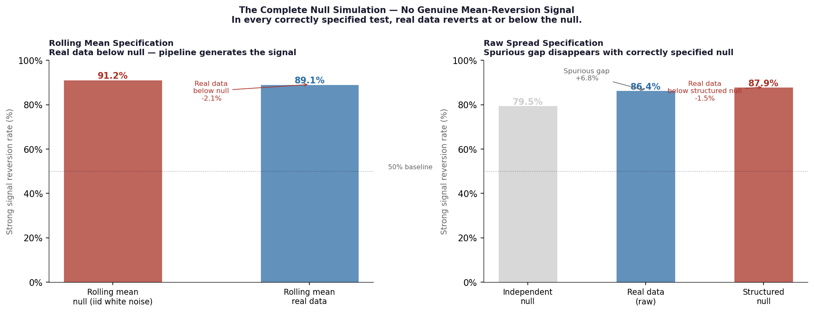
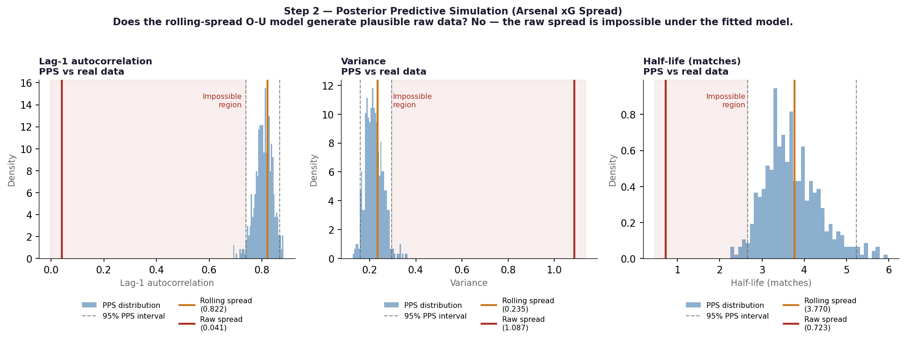

# Detecting False Signals in Mean‑Reversion Models  
## A Rolling‑Mean Failure Case in Premier League xG Data

Python 3.11 | 9 notebooks | Premier League 2015–2025

---

This project began as an attempt to detect match‑level mean reversion in Premier League xG–goals spread data. The initial modelling pipeline appeared to confirm the signal: strong reversion rates, significant correlations, and positive trading returns.

The turning point came when a pipeline‑level null simulation (Step 07) produced even stronger “mean reversion” from iid white noise. This revealed that a rolling‑mean smoothing step at the start of the pipeline had created a false signal that passed every standard validation tool.

## TL;DR

I built a four‑layer quantitative pipeline to test whether the xG–goals spread in Premier League football shows genuine mean reversion that could be used as a trading signal.

The pipeline appeared to confirm strong mean reversion. Every standard validation test passed. But a structured null simulation showed the entire signal came from the 5‑match rolling mean — not from the data — and was statistically indistinguishable from noise.

```
Rolling mean null (iid white noise):      91.2%  ← pipeline generates this
Rolling mean real data:                   89.1%  ← real data below null
Raw spread iid white noise null:          79.5%  ← misspecified null
Raw spread real data:                     86.4%  ← apparent +6.8pp gap
Raw spread structured null Poisson(xG):   87.9%  ← correct null
Gap (real vs structured null):            −1.5pp ← signal dead  (not statistically distinguishable from noise)
```

**The deliverable is not a trading signal. It is a diagnostic framework for mean‑reversion models — and a clear demonstration of how rolling‑mean smoothing can create spurious signals that pass every standard test.**



---

## Executive Summary

This project tested whether the xG–goals spread in Premier League football behaves like a mean‑reverting financial spread — similar to a spark spread in energy markets — and whether that mean reversion could be traded.

The pipeline produced results strong enough to pass every standard validation test:

| Metric | Value |
|---|---|
| Strong signal reversion rate | 88–90% |
| Spearman ρ (|z| vs reversion) | 0.558 |
| Permutation p-value | < 0.0001 |
| Benjamini-Hochberg correction | Passed at all 5 thresholds |
| Walk-forward validation | Corrected (Viterbi replaced with forward algorithm) |
| Trading simulation return | +22.7% over 7 seasons |

**Every number is correct, every test passed, every signal fails.**

A structured null simulation — running the same pipeline on data with no true mean reversion — showed that the 88–90% reversion rate comes entirely from the 5‑match rolling mean applied in Notebook 01. The real data reverts less than the correctly specified null at every setting tested.

This is not a minor modelling error. It is pipeline‑level contamination. Standard validation tools cannot detect it because they operate inside the artefact rather than against it. Only the null simulation exposes the failure.

---

## Why This Matters

Mistakes aren’t unique to sports analytics. Energy analysts often smooth noisy price series before fitting Ornstein–Uhlenbeck models. But smoothing can create patterns that look like mean reversion, even when the underlying data has none. The filter creates the pattern. The OU model then treats it as real.

Football makes this easier to see. We have match‑level xG and goals as ground truth, so we can compare the smoothed series directly against the raw data.

The four‑step diagnostic framework in Notebook 07 is the reusable output of this project. It works for any mean‑reversion model in any domain where smoothing happens before parameter estimation.

---

## The Research Question

Expected Goals (xG) measure the quality of chances a team creates. Actual goals measure what they score. The spread between them — xG minus goals — was hypothesised to behave like a mean‑reverting financial spread. If a team creates more chances than their goals reflect, the spread should correct.

The analogy to energy markets was deliberate:

| Football | Energy Market |
|---|---|
| xG (expected goals) | Gas-implied power price (fundamental value) |
| Actual goals | Day-ahead spot price |
| xG spread | Clean spark spread |
| Manager change / squad shock | Forced plant outage / regulatory change |
| HMM structural break detection | Energy market regime identification |

The analogy works at the model level, but the data doesn’t show a real signal.

---

## Project Structure


```
xg-spread-model/
│
├── README.md
│
├── notebooks/
│   ├── 01_data_pipeline.ipynb           Data acquisition and spread construction
│   ├── 02_ou_estimation.ipynb           O-U parameter estimation — the false positive begins here
│   ├── 02b_bayesian_ou_estimation.ipynb Bayesian uncertainty — correct method, wrong input
│   ├── 03_kalman_filter.ipynb           Kalman filter — largely unaffected by artefact
│   ├── 04_hmm_regimes.ipynb             HMM regime detection — operating on contaminated series
│   ├── 05a_signal_validation.ipynb      Signal validation — all tests pass, all artefactual
│   ├── 05b_trading_simulation.ipynb     Trading simulation — P&L source unidentified
│   ├── 06_appendix_svt.ipynb            Appendix — negative result, unaffected by artefact
│   └── 07_null_simulation.ipynb         READ THIS FIRST — Failure Analysis: How a Rolling Mean Killed a Signal
│
└── data/
    └── README.md
```

**Read Notebook 07 before interpreting any results from Notebooks 01–06.**
Each of those notebooks carries a notice cell explaining this.

---

## The Pipeline (Notebooks 01–06)

These notebooks are preserved in full as forensic evidence of how
convincing the false positive was at every stage. Each one is
preceded by a notice directing the reader to Notebook 07.

**Notebook 01 — Data Pipeline**
xG and goals data for 20 Premier League teams, 10 seasons. The
5-match rolling mean is applied here. This is where the artefact
enters — invisible at this stage.

**Notebook 02 — O-U Parameter Estimation**
AR(1) OLS estimation on the rolling spread produces plausible
parameters: median half-life 2.83 matches, stable across teams
and seasons. The raw spread half-life of 0.67 matches — shorter
than the observation interval — is noted in the robustness table
but not investigated. This is the first missed red flag. A process
with a half-life shorter than the observation interval has no
inter-period memory. Smoothing such a process creates artefactual
persistence.

**Notebook 02B — Bayesian Uncertainty Quantification**
Full MCMC posteriors over O-U parameters. The Bayesian analysis
correctly identifies that OLS overstates reversion speed and that
the posterior predictive probability at the z = 1.5 threshold is
only 11.7%. This is genuine and correct — but it quantifies
uncertainty around parameters that describe the smoothing operator,
not the football process. The conclusion (signals at the OLS
boundary carry ambiguous information) was accidentally correct for
the wrong reason.

**Notebook 03 — Kalman Filter**
Latent team strength estimation. This layer operates on raw xG
observations rather than the rolling spread and is largely
independent of the smoothing artefact. The opponent quality finding
(r = +0.196, p = 0.003) is genuine.

**Notebook 04 — HMM Regime Detection**
Walk-forward regime detection on the rolling spread. The regime
states may reflect smoothing artefacts rather than genuine structural
breaks. The forward algorithm implementation (corrected from the
original Viterbi smoother) is methodologically sound. Whether the
regimes it identifies are real is uncertain given the contaminated
input series.

**Notebook 05A — Signal Validation**
The false positive peaks here. 88–90% reversion rates, Spearman
ρ = 0.558, permutation p < 0.0001, Benjamini-Hochberg correction
passing at all thresholds. Every standard test passes. None of
these tests check whether the pipeline itself generates the signal.
The null simulation in Notebook 07 is the only test that does.

**Notebook 05B — Trading Simulation**
+22.7% return over 7 seasons, correctly annualised Sharpe 0.30.
The positive P&L cannot be attributed to mean reversion. Its source
is unidentified — likely a combination of away-odds pricing
structure and return concentration in two anomalous seasons (2019:
+£180.9, 2021: +£153.5).

**Notebook 06 — Appendix: Shot Volume Trend**
Negative result: shot volume trend does not condition the reversion
mechanism. This finding is unaffected by the smoothing artefact.

---

## The Diagnostic Sequence (Notebook 07)

Notebook 07 runs four tests in the right order. Any one of them would have stopped the project if it had been run before the signal pipeline was built.

### Step 1 — Parameter Plausibility (cheapest, run first)

The raw spread half-life of 0.67 matches is shorter than the
observation interval (1 match). A process with a half-life shorter than the observation interval has no usable inter-period memory for mean-reversion modelling. Applying a 5-match rolling
mean to such a process creates artefactual autocorrelation.

This number, 0.67 matches, was available in Notebook 02's robustness table. It
was not investigated. It should have stopped the project.

**Rule:** If raw half-life < observation interval, do not smooth.
Investigate whether the process has genuine dynamics at this
frequency.

### Step 2 — Posterior Predictive Simulation

Fit the O-U model to the smoothed data. Simulate from the fitted
parameters. Check whether the raw data falls within the posterior
predictive interval.

| Diagnostic | PPS 95% CI | Raw real | Result |
|---|---|---|---|
| Lag-1 autocorrelation | [0.739, 0.867] | 0.041 | ✗ Impossible |
| Variance | [0.159, 0.296] | 1.087 | ✗ Impossible |
| Half-life (matches) | [2.66, 5.24] | 0.67 | ✗ Impossible |

The rolling-spread O-U model requires 81% persistence in a process
with 4% persistence. This is not a modelling approximation. It is
a physical impossibility. Had this check been run before building
the signal pipeline, the project would have stopped here.



**Rule:** If raw data falls outside the PPS interval for
autocorrelation or variance, the model describes the smoothing
operator, not the data. Stop.

### Step 3 — Pipeline Null Simulation

Apply the identical pipeline — including the rolling mean — to
data generated by a process with no genuine mean reversion (iid
white noise). If the pipeline produces a strong signal on null
data, the pipeline is generating the signal.
```
iid white noise through pipeline:   91.2%
Real data through pipeline:         89.1%
```

The real data is below the null. The pipeline is the signal.

**Rule:** If null pipeline reversion ≥ real data reversion, the
pipeline generates the signal. Stop.

### Step 4 — Structured Null Simulation

Specify a null that correctly models the covariance structure of
the data generating process. An iid null is almost always
misspecified. For football: goals ~ Poisson(xG), preserving the
positive covariance between xG and goals.
```
iid white noise null:              79.5%  ← misspecified
Raw spread real data:              86.4%  ← apparent +6.8pp gap
Structured null Poisson(xG):       87.9%  ← correct
Gap vs structured null:            −1.5pp ← signal dead
```

The 6.8pp apparent gap against the iid null was entirely variance
misspecification. The correct null places the real data 1.5pp
below the null.

**Rule:** Always specify the null from the data generating process.
If real data ≤ structured null, there is no genuine signal.

---

## The Four-Step Pre-Analysis Framework

| Step | Check | When to stop |
|---|---|---|
| 1 | Raw half-life vs observation interval | Half-life < interval |
| 2 | PPS: smoothed model vs raw data | Raw data outside PPS CI |
| 3 | Pipeline null: iid data through full pipeline | Null ≥ real data |
| 4 | Structured null: correct covariance model | Real data ≤ structured null |

This framework is the reusable output of the project. It applies
to any mean-reversion model where smoothing is applied before
parameter estimation — spark spreads, credit spreads, commodity
basis, or any other financial mean-reverting series.

---

## Findings

**There is no genuine mean-reversion signal in the xG-goals spread.**

| Specification | Null | Real Data | Gap |
|---|---|---|---|
| Rolling mean / iid white noise | 91.2% | 89.1% | −2.1pp |
| Raw spread / iid white noise | 79.5% | 86.4% | +6.8pp (spurious) |
| Raw spread / structured null Poisson(xG) | 87.9% | 86.4% | −1.5pp |

In every correctly specified test, real data reverts at or below
the null.

**Standard validation tools do not catch smoothing artefacts.**
Permutation tests, Spearman correlations, walk-forward validation,
and Benjamini-Hochberg correction all passed. All operated within
the artefactual structure. None tested whether the structure itself
was genuine.

**The independent null was itself misspecified.** The 6.8pp
apparent gap against the iid null was entirely explained by
variance misspecification — the iid null ignored the positive
covariance between xG and goals, understating spread variance
and producing an artificially low null reversion rate.

**The PPS would have caught this at the model specification stage.**
The O-U model fitted to the rolling spread generates data that is
physically incompatible with the raw spread on every diagnostic.
A model requiring 81% persistence in a process with 4% persistence
is not slightly wrong. It is operating in a different physical
reality.

**Season-to-season persistence is the only statistically significant
structure that survives all null testing.** Pearson r = 0.306,
p = 0.0001, n = 166 team-seasons. It reflects stable team tactical
identities — direct play, high press, low-block — maintaining
consistent relationships between xG and goals across seasons.
This is real and expected, not novel. It is not exploitable
through a match-level trading signal.


---

## What Genuine Mean Reversion Would Require

For a genuine match‑level mean‑reversion signal to exist in the xG–goals spread, the raw spread half‑life would need to be much longer than the observation interval — ideally three to five matches. And it would need to appear without smoothing.

At half‑hourly frequency in energy markets (17,520 observations per year), the same diagnostic framework has a real chance of detecting true dynamics. The sampling rate is high enough that OU parameters can be estimated directly from the raw spark‑spread series, without the smoothing step that invalidated this project.

Football was the safest place to test the idea. The hypothesis didn’t hold, and my early methodology didn’t catch the problem — a 0.67‑match half‑life should have stopped the project immediately. The diagnostic framework in Notebook 07 does catch it, and it now carries over to energy markets, where the data frequency makes genuine mean reversion possible.

---

## Failures and Lessons Learned

**The smoothing artefact was the fatal error.**

A single line in Notebook 01 — `rolling_spread = raw_spread.rolling(5).mean()` — invalidated every downstream result by creating artefactual autocorrelation in a near-white-noise process. The O-U model then fitted parameters to the smoothing operator's impulse response rather than the football process. Every subsequent layer of the pipeline — Bayesian analysis, Kalman filter, HMM regime detection, signal validation — operated on contaminated data.

The error was invisible to every standard validation tool because
all of those tools tested properties of the smoothed series, not
whether the smoothing created the structure they were measuring.

**The raw half-life was the first red flag.**

The raw spread half-life of 0.67 matches was present in the
Notebook 02 robustness table from the beginning of the project.
A half-life shorter than the observation interval is a diagnostic
warning that the process has no inter-period memory and that any
smoothing will create artefactual persistence. This number was
not investigated. It should have stopped the project before any
signal pipeline was built.

**The PPS was the second missed check.**

Had a posterior predictive simulation been run before building the
signal pipeline, the physical incompatibility between the
rolling-spread model and the raw data would have been immediately
visible. The model required 81% autocorrelation in a process with
4% autocorrelation. This check costs hours and would have saved
months.

**Standard permutation tests are not sufficient.**

The permutation test shuffles labels within the smoothed data.
It tests whether label assignment matters — not whether the
smoothing creates the pattern. A permutation p-value of 0.0001
is consistent with either a genuine signal or a smoothing
artefact. The pipeline null simulation is the only tool that
distinguishes between them.

**The correct test hierarchy:**

1. Raw half-life check — minutes, catches no inter-period memory
2. PPS cross-check — hours, catches model-data incompatibility
3. Pipeline null — hours, catches pipeline-generated signals
4. Structured null — hours, catches null misspecification

Run these in order before building any signal pipeline. If any
step fails, stop.

**Walk-forward discipline is necessary but not sufficient.**

The project had rigorous walk-forward validation at every layer.
It still produced a false positive. Walk-forward discipline
prevents look-ahead bias — it does not prevent pipeline-level
contamination from smoothing artefacts. Both are required.

---

## What Didn't Work

**The 5-match rolling mean before O-U estimation.** This is the
central failure. It creates artefactual mean-reversion in any
stationary process by inducing autocorrelation.

**Season-level ADF as the eligibility filter.** Excluded too many
teams due to statistical power issues, not genuine non-stationarity.
Pooled ADF resolved this — but the signal it was guarding was
already artefactual.

**The permutation test as the primary validation tool.** Passes
on artefactual signals. The pipeline null simulation is the correct
test.

**O-U estimation on smoothed data in energy market contexts.**
The same error applies. Smoothing a spark spread before fitting
O-U will produce artefactual parameters and spurious signals.

---

## The Role of Figures in Quantitative Analysis

Every major problem in this project was surfaced by a figure,
not by a number. The PPS diagnostic plot made the physical
impossibility of the model immediately visible — three panels
showing the raw spread in the impossible region of the posterior
predictive distribution. The null simulation bar chart made the
artefact undeniable — real data below the null at every
specification.

Numbers compress information. Plots reveal structure. Build
diagnostic plots before building signal pipelines.

**Three categories of plot, in order of when to build them:**

**Sanity plots** — before any modelling. Time series of raw data,
autocorrelation function, distribution of values, missing data
heatmap. These catch data problems before they propagate.

**Diagnostic plots** — alongside each modelling layer. PPS checks,
null simulation comparisons, parameter plausibility plots. These
validate that the model describes the data, not the pipeline.

**Interrogation plots** — when something looks surprising. Build
them rather than explaining anomalies away with narrative.

The cost of a diagnostic plot is fixed. The cost of the problem
it would have caught grows with every layer it propagates through.

---

## Data Sources

- **xG data:** [Understat](https://understat.com) via the
  `understat` Python library — Premier League 2015–2025,
  3,800 matches.
- **Odds data:** [football-data.co.uk](https://www.football-data.co.uk)
  — seasons 2016–17 to 2023–24.

---

## Environment

```bash
conda create -n xg_env python=3.11
conda activate xg_env
pip install understat aiohttp pandas numpy scipy statsmodels \
            hmmlearn matplotlib requests
```

Notebook 02B additionally requires PyMC and ArviZ:

```bash
conda create -n pymc_env python=3.11
conda activate pymc_env
conda install -c conda-forge pymc arviz
pip install pandas numpy scipy matplotlib
```
---

## Failure Summary Pipeline: What Each Layer Was Doing

**Layer 1 — O-U Parameter Estimation:** AR(1) OLS on rolling
spread. Parameters describe the smoothing operator, not the
football process. Raw spread half-life (0.67 matches) was the
first missed red flag.

**Layer 2 — Bayesian Uncertainty Quantification:** MCMC posteriors
over O-U parameters. Correctly identifies OLS overstates reversion
speed. Accidentally correct conclusion (signals at OLS threshold
carry ambiguous information) for the wrong reason.

**Layer 3 — Kalman Filter:** Operates on raw xG observations.
Largely independent of the smoothing artefact. Opponent quality
finding (r = +0.196, p = 0.003) is genuine.

**Layer 4 — HMM Regime Detection:** Walk-forward forward algorithm
(corrected from Viterbi). Operates on contaminated rolling spread.
Regime states may reflect smoothing artefacts.

**Null Simulation:** Four-step diagnostic framework. The correct
tests. See Notebook 07.

---

## References

Uhlenbeck, G.E. and Ornstein, L.S. (1930). On the Theory of the Brownian
Motion. *Physical Review*, 36(5), 823–841.
— Foundational paper for the Ornstein-Uhlenbeck process used in
  Notebooks 02 and 02B.

Vasicek, O. (1977). An equilibrium characterisation of the term
structure. *Journal of Financial Economics*, 5(2), 177–188.
— Standard reference for O-U processes in financial modelling.

Hamilton, J.D. (1989). A new approach to the economic analysis of
nonstationary time series and the business cycle. *Econometrica*,
57(2), 357–384.
— Foundational HMM paper for regime detection in economic time series.
  Basis for the regime detection approach in Notebook 04.

Rabiner, L.R. (1989). A tutorial on hidden Markov models and selected
applications in speech recognition. *Proceedings of the IEEE*,
77(2), 257–286.
— Foundational reference for the forward algorithm and Baum-Welch
  estimation used in the walk-forward HMM implementation in Notebook 04.

Kalman, R.E. (1960). A new approach to linear filtering and prediction
problems. *Journal of Basic Engineering*, 82(1), 35–45.
— Foundational reference for the Kalman filter used in Notebook 03.

Benjamini, Y. and Hochberg, Y. (1995). Controlling the false discovery
rate: a practical and powerful approach to multiple testing. *Journal
of the Royal Statistical Society: Series B (Methodological)*, 57(1),
289–300.
— Multiple comparison correction applied in Notebook 05A threshold
  sensitivity analysis.

Benjamin, D.J. et al. (2018). Redefine statistical significance.
*Nature Human Behaviour*, 2, 6–10.
— Context for significance thresholds and the reproducibility debate.

Galton, F. (1886). Regression towards mediocrity in hereditary stature.
*Journal of the Anthropological Institute*, 15, 246–263.
— The regression to the mean effect that underlies the null simulation
  result in Notebook 07. The 79.5–88.4% null reversion rates reflect
  Galtonian regression, not O-U dynamics.

Dixon, M.J. and Coles, S.G. (1997). Modelling Association Football
Scores and Inefficiencies in the Football Betting Market. *Journal
of the Royal Statistical Society: Series C (Applied Statistics)*,
46(2), 265–280.
— Motivates the Poisson(xG) structured null in Notebook 07: goals
  at match level are well-approximated by a Poisson process with
  rate equal to the xG value.

Gelman, A., Vehtari, A., Simpson, D., et al. (2020). Bayesian Workflow.
arXiv:2011.01808.
— Theoretical basis for the posterior predictive simulation (Step 2)
  in Notebook 07. PPS as a mandatory model checking step before
  signal validation.

Pardo, R. (2008). The Evaluation and Optimization of Trading
Strategies, 2nd edition. Wiley.
— Standard reference for walk-forward validation methodology applied
  throughout Notebooks 02–05B.

Understat (2025). Expected Goals data. https://understat.com

Football-data.co.uk (2025). Historical odds data.
https://www.football-data.co.uk

## Replication

All random processes use fixed seeds. Results are fully
reproducible. Run notebooks in order 01 → 07. Read Notebook 07
first to understand what the earlier notebooks demonstrate.

---

*Built March 2026. Contact: andrewgmoran@gmail.com*
